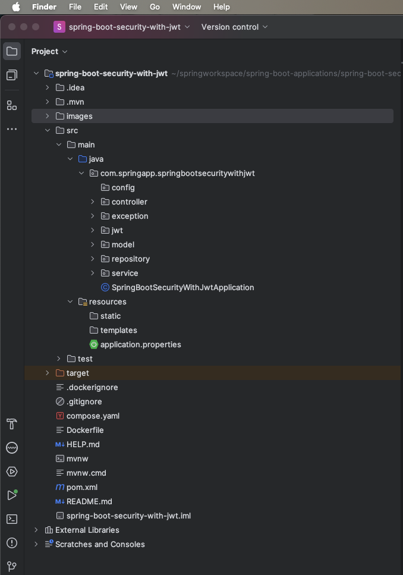
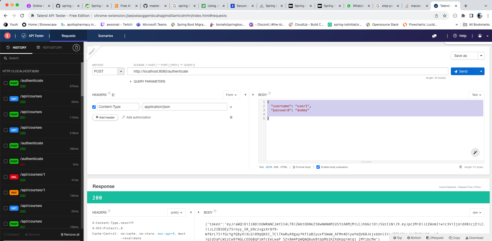
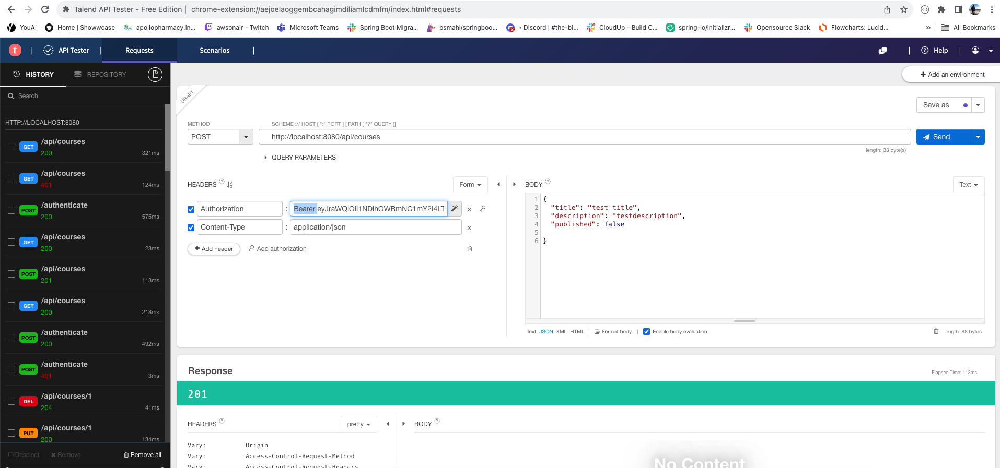
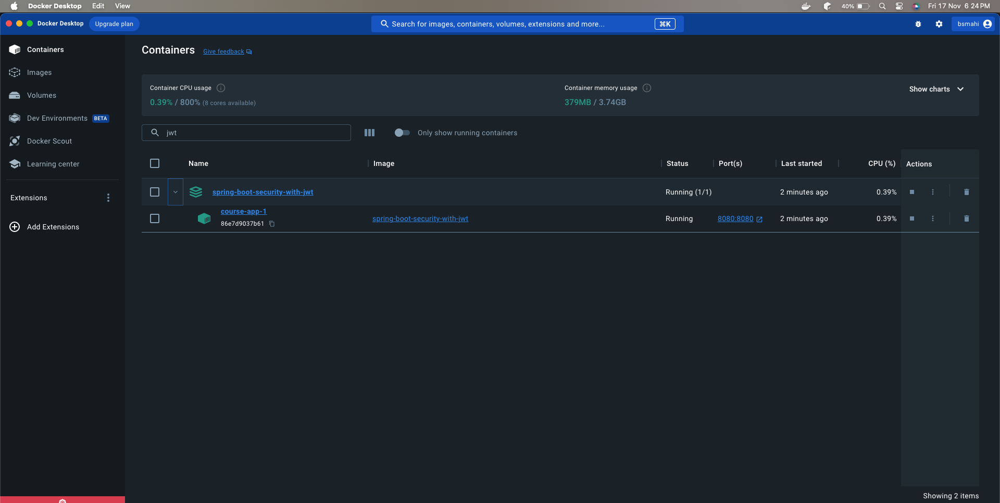
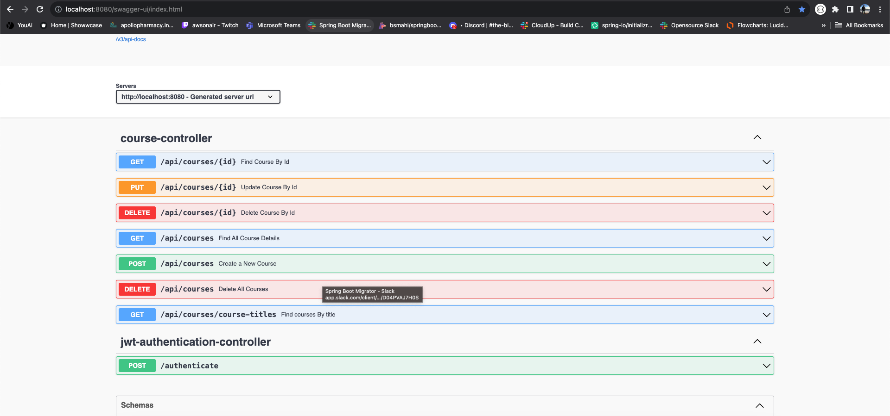

# Spring Boot Security With JWT + Rest API

We will build a Spring Boot JPA Rest CRUD API for a Course application in that:

- Each Course has id, title, description, published status
- All the Api's help to perform create, retrieve, update, delete Courses
- We have also defined custom query method to retrieve details based on the title and published

## Technologies Used

- Java 17
- Spring Boot 3.1.x
- Spring Modules Covered: Spring Boot Web, Spring Data Jpa, Spring Actuator, Spring Security, Spring OAuth2 Resource Server OpenAPI
- Database: H2
- Build Tool: Maven

We will develop a Course application by creating a Spring Boot JPA Rest CRUD API.

- Each Course has id, title, description, published status.
- Apis help to create, retrieve, update, delete Tutorials.
- Apis also support custom finder methods such as find by published status or by title.

These are APIs that we need to provide:

| HTTP Method |                    Urls                    |                    Description                    |
|:-----------:|:------------------------------------------:|:-------------------------------------------------:|
|    POST     |                /api/courses                |                 Create New Course                 |
|     GET     |                /api/courses                |                Get All the Courses                |
|     GET     |              /api/courses/:id              |             Retrieve a Course by :id              |
|     PUT     |              /api/courses/:id              |              Update a Course by :id               |
|   DELETE    |              /api/courses/:id              |              Delete a Course by :id               |
|   DELETE    |                /api/courses                |              Delete All the Courses               |
|     GET     | /api/courses/courses-title?title=[keyword] | Retrieve all Courses which title contains keyword |

## Project Folder Structure



Let me explain it briefly

- `Course.java` data model class corresponds to entity and table courses
- `CourseRepository.java` the interface extends JpaRepository for CRUD methods and custom finder methods. It will be
  autowired in CourseController
- `CourseController.java` the class where we will define all endpoints as a presentation layer
- Configuration for Spring Datasource, JPA & Hibernate in `application.properties`
- `data.sql` to load initial data when the application starts up
- `pom.xml` contains all the dependencies required for this application
- `JwtAuthenticationController.java` controller which accepts username and password for generating jwt token
- `JwtSecurityConfig.java` security config class for handling authentication and authorization
- `JwtTokenRequest.java` class which holds request parameters
- `JwtTokenResponse.java` class which holds response
- `JwtTokenService.java` class which has the business logic for generating token


## Create Spring Boot Project

For pre-initialized project using Spring Initializer, please
click [here](https://start.spring.io/#!type=maven-project&language=java&platformVersion=3.1.5&packaging=jar&jvmVersion=17&groupId=com.springapp&artifactId=spring-boot-security-with-jwt&name=spring-boot-security-with-jwt&description=Demo%20project%20for%20Spring%20Boot&packageName=com.springapp.spring-boot-security-with-jwt&dependencies=web,data-jpa,lombok,h2,actuator,security,oauth2-resource-server)
## Configure Spring Datasource, JPA, Hibernate

```properties
spring.datasource.url=jdbc:h2:mem:testdb
spring.h2.console.enabled=true
spring.jpa.defer-datasource-initialization=true
spring.jpa.show-sql=true

spring.h2.console.settings.web-allow-others=true
```

## Define Course Entity

Our Data model is Course with four fields: id, title, description, published.
In model package, we define Course class.

```java
package com.springapp.springbootappwithmysql.model;

import jakarta.persistence.*;
import lombok.AllArgsConstructor;
import lombok.Data;
import lombok.RequiredArgsConstructor;

@Entity
@Table(name = "courses")
@Data
@RequiredArgsConstructor
@AllArgsConstructor
public class Course {

    @Id
    @GeneratedValue(strategy = GenerationType.AUTO)
    private long id;

    @Column(name = "title")
    private String title;

    @Column(name = "description")
    private String description;

    @Column(name = "published")
    private boolean published;
}
```

- `@Entity` annotation indicates that the class is a persistent Java class
- `@Table` annotation provides the table that maps this entity
- `@Id` annotation is for the primary key
- `@GeneratedValue` annotation is used to define generation strategy for the primary key. `GenerationType.AUTO` means
  Auto Increment field
- `@Column` annotation is used to define the column in database that maps annotated field

## CourseRepository

Let's create a repository interface to interact with database operations

In _repository_ folder, create `CourseRepository` interface that `extends JpaRepository`

```java
package com.springapp.springbootappwithmysql.repository;

import com.springapp.springbootappwithmysql.model.Course;
import org.springframework.data.jpa.repository.JpaRepository;
import org.springframework.stereotype.Repository;

import java.util.List;

@Repository
public interface CourseRepository extends JpaRepository<Course, Long> {

    List<Course> findByTitleContaining(String title);

}
```

Since Spring is providing boilerplate/implementation code for the `findAll(), findById(), save(), delete()`
and `deleteById()` through `JpaRepository` interface

We can also define the custom methods:

- `findByTitleContaining()`: returns all Courses which title contains input title

## CourseController

Let's create CourseController class define the all the endpoints

```java
package com.springapp.springbootappwithmysql.controller;

import com.springapp.springbootappwithmysql.exception.CourseNotFoundException;
import com.springapp.springbootappwithmysql.model.Course;
import com.springapp.springbootappwithmysql.service.CourseService;
import io.swagger.v3.oas.annotations.Operation;
import org.springframework.http.HttpStatus;
import org.springframework.http.ResponseEntity;
import org.springframework.web.bind.annotation.*;
import org.springframework.web.servlet.support.ServletUriComponentsBuilder;

import java.util.List;
import java.util.Optional;

@CrossOrigin(origins = "http://localhost:8081") // to allow course-app frontend application
@RestController
@RequestMapping("/api/courses")
public class CourseController {

    private final CourseService service;

    public CourseController(CourseService service) {
        this.service = service;
    }

    // http://localhost:8080/api/courses/
    @GetMapping
    @Operation(summary = "Find All Course Details")
    public ResponseEntity<List<Course>> getAllCourses() {
        Optional<List<Course>> courses = service.findAll();

        return courses.map(courseDetails -> new ResponseEntity<>(courseDetails, HttpStatus.OK))
                .orElseThrow(() -> new CourseNotFoundException("No Courses are available.."));
    }

    // http://localhost:8080/api/courses/course-titles?title=boot
    @GetMapping("/course-titles")
    @Operation(summary = "Find courses By title")
    public ResponseEntity<List<Course>> getAllCoursesBasedOnTitle(@RequestParam String title) {
        Optional<List<Course>> courses = service.findByTitleContaining(title);

        return courses.map(courseDetails -> new ResponseEntity<>(courseDetails, HttpStatus.OK))
                .orElseThrow(() -> new CourseNotFoundException("No Courses are available.."));
    }

    // http://localhost:8080/api/courses/1
    @GetMapping("/{id}")
    @Operation(summary = "Find Course By Id")
    public ResponseEntity<Course> getCourseById(@PathVariable("id") long id) {
        Optional<Course> course = service.findById(id);

        return course.map(courseOne -> new ResponseEntity<>(courseOne, HttpStatus.OK))
                .orElseThrow(() -> new CourseNotFoundException("No Courses are available.."));

    }

    // http://localhost:8080/api/courses
    @PostMapping
    @Operation(summary = "Create a New Course")
    public ResponseEntity<Course> createCourse(@RequestBody Course course) {
        Optional<Course> newCourse = service.createCourse(course);
        var location = ServletUriComponentsBuilder.fromCurrentRequest()
                .path("/{id}")
                .buildAndExpand(newCourse.get().getId())
                .toUri();

        return ResponseEntity.created(location)
                .build();
    }

    @PutMapping("/{id}")
    @Operation(summary = "Update Course By Id")
    public ResponseEntity<Optional<Course>> updateCourse(@PathVariable("id") long id,
                                                         @RequestBody Course course) {
        var courseData = service.findById(id);

        if (courseData.isPresent()) {
            Course updateCourse = courseData.get();
            updateCourse.setTitle(course.getTitle());
            updateCourse.setDescription(course.getDescription());
            updateCourse.setPublished(course.isPublished());
            return new ResponseEntity<>(service.createCourse(updateCourse), HttpStatus.OK);
        } else {
            return new ResponseEntity<>(HttpStatus.NOT_FOUND);
        }
    }

    @DeleteMapping
    @Operation(summary = "Delete All Courses")
    public ResponseEntity<HttpStatus> deleteAllCourses() {
        service.deleteAllCourses();
        return new ResponseEntity<>(HttpStatus.NO_CONTENT);
    }

    @DeleteMapping("/{id}")
    @Operation(summary = "Delete Course By Id")
    public ResponseEntity<HttpStatus> deleteCourseById(@PathVariable("id") long id) {
        service.deleteCourseById(id);
        return new ResponseEntity<>(HttpStatus.NO_CONTENT);
    }

}
```
## JwtTokenRequest
In this step, we will create JwtTokenRequest class
```java
package com.springapp.springbootsecuritywithjwt.jwt;

public record JwtTokenRequest(String username, String password) {}
```

## JwtTokenResponse
In this step, we will create JwtTokenResponse class

```java
package com.springapp.springbootsecuritywithjwt.jwt;

public record JwtTokenResponse(String token) {}
```
## JwtTokenService
In this step, we will create JwtTokenService class

```java
package com.springapp.springbootsecuritywithjwt.jwt;

import org.springframework.security.core.Authentication;
import org.springframework.security.core.GrantedAuthority;
import org.springframework.security.oauth2.jwt.JwtClaimsSet;
import org.springframework.security.oauth2.jwt.JwtEncoder;
import org.springframework.security.oauth2.jwt.JwtEncoderParameters;
import org.springframework.stereotype.Service;

import java.time.Instant;
import java.time.temporal.ChronoUnit;
import java.util.stream.Collectors;

@Service
public class JwtTokenService {

    private final JwtEncoder jwtEncoder;

    public JwtTokenService(JwtEncoder jwtEncoder) {
        this.jwtEncoder = jwtEncoder;
    }

    public String generateToken(Authentication authentication) {

        var scope = authentication
                .getAuthorities()
                .stream()
                .map(GrantedAuthority::getAuthority)
                .collect(Collectors.joining(" "));

        var claims = JwtClaimsSet.builder()
                .issuer("self")
                .issuedAt(Instant.now())
                .expiresAt(Instant.now().plus(90, ChronoUnit.MINUTES))
                .subject(authentication.getName())
                .claim("scope", scope)
                .build();

        return this.jwtEncoder
                .encode(JwtEncoderParameters.from(claims))
                .getTokenValue();
    }
}
```
## JwtAuthenticationController
In this step, we will create JwtAuthenticationController class

```java
package com.springapp.springbootsecuritywithjwt.jwt;

import org.springframework.http.ResponseEntity;
import org.springframework.security.authentication.AuthenticationManager;
import org.springframework.security.authentication.UsernamePasswordAuthenticationToken;
import org.springframework.web.bind.annotation.PostMapping;
import org.springframework.web.bind.annotation.RequestBody;
import org.springframework.web.bind.annotation.RestController;

@RestController
public class JwtAuthenticationController {

    private final JwtTokenService tokenService;

    private final AuthenticationManager authenticationManager;

    public JwtAuthenticationController(JwtTokenService tokenService,
                                       AuthenticationManager authenticationManager) {
        this.tokenService = tokenService;
        this.authenticationManager = authenticationManager;
    }

    @PostMapping("/authenticate")
    public ResponseEntity<JwtTokenResponse> generateToken(@RequestBody JwtTokenRequest jwtTokenRequest) {

        var authenticationToken = new UsernamePasswordAuthenticationToken(
                        jwtTokenRequest.username(),
                        jwtTokenRequest.password());

        var authentication = authenticationManager.authenticate(authenticationToken);

        var token = tokenService.generateToken(authentication);

        return ResponseEntity.ok(new JwtTokenResponse(token));
    }
}
```
## JwtSecurityConfig
In this step, we will create JwtSecurityConfig class and configure for authentication and authorization

```java
package com.springapp.springbootsecuritywithjwt.jwt;

import com.nimbusds.jose.JOSEException;
import com.nimbusds.jose.jwk.JWKSet;
import com.nimbusds.jose.jwk.RSAKey;
import com.nimbusds.jose.jwk.source.JWKSource;
import com.nimbusds.jose.proc.SecurityContext;
import org.springframework.context.annotation.Bean;
import org.springframework.context.annotation.Configuration;
import org.springframework.http.HttpMethod;
import org.springframework.security.authentication.AuthenticationManager;
import org.springframework.security.authentication.ProviderManager;
import org.springframework.security.authentication.dao.DaoAuthenticationProvider;
import org.springframework.security.config.annotation.method.configuration.EnableMethodSecurity;
import org.springframework.security.config.annotation.web.builders.HttpSecurity;
import org.springframework.security.config.annotation.web.configurers.AbstractHttpConfigurer;
import org.springframework.security.config.annotation.web.configurers.HeadersConfigurer;
import org.springframework.security.core.userdetails.User;
import org.springframework.security.core.userdetails.UserDetails;
import org.springframework.security.core.userdetails.UserDetailsService;
import org.springframework.security.oauth2.jwt.JwtDecoder;
import org.springframework.security.oauth2.jwt.JwtEncoder;
import org.springframework.security.oauth2.jwt.NimbusJwtDecoder;
import org.springframework.security.oauth2.jwt.NimbusJwtEncoder;
import org.springframework.security.provisioning.InMemoryUserDetailsManager;
import org.springframework.security.web.SecurityFilterChain;
import org.springframework.security.web.servlet.util.matcher.MvcRequestMatcher;
import org.springframework.security.web.util.matcher.AntPathRequestMatcher;
import org.springframework.web.servlet.handler.HandlerMappingIntrospector;

import java.security.KeyPair;
import java.security.KeyPairGenerator;
import java.security.interfaces.RSAPrivateKey;
import java.security.interfaces.RSAPublicKey;
import java.util.UUID;

import static org.springframework.security.config.Customizer.withDefaults;
import static org.springframework.security.web.util.matcher.AntPathRequestMatcher.antMatcher;

@Configuration
@EnableMethodSecurity(jsr250Enabled = true, securedEnabled = true)
public class JwtSecurityConfig {

    @Bean
    SecurityFilterChain securityFilterChain(HttpSecurity http,
                                            HandlerMappingIntrospector handlerMappingIntrospector) throws Exception {

        MvcRequestMatcher.Builder mvcMatcherBuilder = new MvcRequestMatcher.Builder(handlerMappingIntrospector);
        
        http.authorizeHttpRequests(auth -> auth
                .requestMatchers(mvcMatcherBuilder.pattern(HttpMethod.OPTIONS, "/**")).permitAll()
                .requestMatchers(mvcMatcherBuilder.pattern("/authenticate")).permitAll()// permitted /authenticate endpoint
                .requestMatchers(new AntPathRequestMatcher("/api/courses/**")).authenticated()// once bearer token is available in header, we enabaled for /api/courses/** endpoints
                .requestMatchers(new AntPathRequestMatcher("/swagger-ui/**")).authenticated()// enabled for swagger also
                .requestMatchers(new AntPathRequestMatcher("/v3/api-docs/**")).permitAll()
                .requestMatchers(antMatcher("/h2-console/**")).permitAll()); //no authentication for h2 console

        http.csrf(AbstractHttpConfigurer::disable);

        http.oauth2ResourceServer((oauth2) -> oauth2.jwt(withDefaults()));

        http.httpBasic(withDefaults());

        http.headers(header -> header.frameOptions(HeadersConfigurer.FrameOptionsConfig::sameOrigin));

        return http.build();
    }

    @Bean
    public AuthenticationManager authenticationManager(UserDetailsService userDetailsService) {
        var authenticationProvider = new DaoAuthenticationProvider();
        authenticationProvider.setUserDetailsService(userDetailsService);

        return new ProviderManager(authenticationProvider);
    }

    @Bean
    public UserDetailsService userDetailsService() {
        UserDetails user = User.withUsername("user1")
                .password("{noop}dummy")
                .authorities("read")
                .roles("USER")
                .build();

        return new InMemoryUserDetailsManager(user);
    }

    @Bean
    public JWKSource<SecurityContext> jwkSource() {
        JWKSet jwkSet = new JWKSet(rsaKey());

        return ((jwkSelector, securityContext) -> jwkSelector.select(jwkSet));
    }

    @Bean
    JwtEncoder jwtEncoder(JWKSource<SecurityContext> jwkSource) {
        return new NimbusJwtEncoder(jwkSource);
    }

    @Bean
    JwtDecoder jwtDecoder() throws JOSEException {
        return NimbusJwtDecoder
                .withPublicKey(rsaKey().toRSAPublicKey())
                .build();
    }

    @Bean
    public RSAKey rsaKey() {
        KeyPair keyPair = keyPair();

        return new RSAKey
                .Builder((RSAPublicKey) keyPair.getPublic())
                .privateKey((RSAPrivateKey) keyPair.getPrivate())
                .keyID(UUID.randomUUID().toString())
                .build();
    }

    @Bean
    public KeyPair keyPair() {
        try {
            var keyPairGenerator = KeyPairGenerator.getInstance("RSA");
            keyPairGenerator.initialize(2048);
            return keyPairGenerator.generateKeyPair();
        } catch (Exception e) {
            throw new IllegalStateException(
                    "Unable to generate an RSA Key Pair", e);
        }
    }

}

```


## Run & Test

Run Spring Boot application with command: `mvn spring-boot:run`


> Generate JwtToken POST Request: http://localhost:8080/authenticate

Open chrome browser, install Talend API Tester extension


**NOTE: For accessing course HTTP method and its endpoints, we need to copy the JWT Token from the previous step and add to the Authorization header**

> Create a new course: http://localhost:9090/api/courses

Added the jwt token to the Authorization header with prefix **"Bearer "+jwt token**

**NOTE: Space after Bearer is mandatory else it will mix with token string**


**Sample POST Request**

```json
{
  "title": "test title",
  "description": "testdescription",
  "published": false
}
```
> Get All courses: http://localhost:8080/api/courses/

> Get A Single Course: http://localhost:9090/api/courses/1

> Get All course based on the title: http://localhost:9090/api/courses/course-titles?title=boot


> Delete All courses: http://localhost:9090/api/courses/

> Delete A Single Course: http://localhost:9090/api/courses/1

> Update A Single Course: http://localhost:9090/api/courses/1

**Sample PUT Request**

```json
{
  "title": "Updated test title",
  "description": "Updated test description",
  "published": true
}
```

## Create Dockerfile for Spring Boot App

Create .Dockerfile in the root folder

```properties
FROM maven:3.8.5-openjdk-17
WORKDIR /spring-boot-security-with-jwt
COPY . .
RUN mvn clean install -DskipTests
CMD mvn spring-boot:run
```

- FROM: install the image of the Maven – JDK version.
- WORKDIR: path of the working directory.
- COPY: copy all the files inside the project directory to the container.
- RUN: execute a command-line inside the container: mvn clean install -DskipTests to install the dependencies
  in `pom.xml`.
- CMD: run script `mvn spring-boot:run` after the image is built.

## Write Docker Compose configurations

On the root of the project directory, we'll create the compose.yml file.

Follow version 3 syntax defined by Docker:

```yaml
version: '3.8'

services:
  course-app:
```

`version`: Docker Compose file format version will be used.
`services`: individual services in isolated containers.

Our application has two services: `course-app` (Spring Boot) 

Here go with the complete docker compose file

```yaml
version: '3.8'

services:
  course-app:
    image: spring-boot-security-with-jwt
    build:
      context: .
      dockerfile: Dockerfile
    ports:
      - $SPRING_LOCAL_PORT:$SPRING_DOCKER_PORT
```

## Components of Docker Compose File

- course-app:
    - `image`: final image name
    - `build`: configuration options that are applied at build time that we defined in the _Dockerfile_ with relative
      path
    - `ports` : Inbound and outbound ports

## Docker Compose Environment variables

In the service configuration, we utilized environmental variables specified within the `.env` file.
Now we will create it.

_.env_

```properties
SPRING_LOCAL_PORT=8080
SPRING_DOCKER_PORT=8080
```

## Run the Spring Boot microservice with Docker Compose

**NOTE: Before executing the Docker Compose command, it is imperative to initiate the Docker Desktop software.**

To spin up the containers for both course-app and mysql database, execute the docker compose command given below.

> docker compose up

Docker will pull the MySQL and Maven images (if our machine does not have it before).

The services can be run on the background with command:

> docker compose up -d

```logsyaml
puneethsai@Puneeths-MacBook-Pro spring-boot-security-with-jwt % docker compose up -d
[+] Running 1/1
 ! course-app Warning                                                                                                                                                                                3.5s 
[+] Building 75.7s (10/10) FINISHED                                                                                                                                                  docker:desktop-linux
 => [course-app internal] load build definition from Dockerfile                                                                                                                                      0.0s
 => => transferring dockerfile: 174B                                                                                                                                                                 0.0s
 => [course-app internal] load .dockerignore                                                                                                                                                         0.0s
 => => transferring context: 680B                                                                                                                                                                    0.0s
 => [course-app internal] load metadata for docker.io/library/maven:3.8.5-openjdk-17                                                                                                                 1.8s
 => [course-app auth] library/maven:pull token for registry-1.docker.io                                                                                                                              0.0s
 => CACHED [course-app 1/4] FROM docker.io/library/maven:3.8.5-openjdk-17@sha256:3a9c30b3af6278a8ae0007d3a3bf00fff80ec3ed7ae4eb9bfa1772853101549b                                                    0.0s
 => [course-app internal] load build context                                                                                                                                                         0.1s
 => => transferring context: 836.02kB                                                                                                                                                                0.1s
 => [course-app 2/4] WORKDIR /spring-boot-security-with-jwt                                                                                                                                          0.1s
 => [course-app 3/4] COPY . .                                                                                                                                                                        0.1s
 => [course-app 4/4] RUN mvn clean install -DskipTests                                                                                                                                              71.7s
 => [course-app] exporting to image                                                                                                                                                                  1.8s
 => => exporting layers                                                                                                                                                                              1.8s
 => => writing image sha256:31f2ac1a54bec1be62ddeaa464b248f32fcab149f8ed9d257aa7c42ee8b755f5                                                                                                         0.0s
 => => naming to docker.io/library/spring-boot-security-with-jwt                                                                                                                                     0.0s
[+] Running 2/2
 ✔ Network spring-boot-security-with-jwt_default         Created                                                                                                                                     0.3s 
 ✔ Container spring-boot-security-with-jwt-course-app-1  Started                                                                                                                                     0.1s
```

# Containers Running in Docker Desktop



## Run & Test

Using OpenAPI Documentation, we'll be able to access all the operations, please access the below URL

> http://localhost:8080/swagger-ui/index.html

